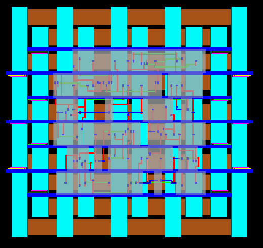

<div align="center">

# ⚡ 32-Bit Kogge-Stone Adder: RTL to GDSII

</div>

<div align="center">


*A high-performance parallel prefix adder implementing complete ASIC design flow*

[Overview](#-overview) • [Architecture](#-architecture) • [Results](#-results) • [Getting Started](#-getting-started) • [Documentation](#-documentation)

---

</div>

## 🎯 Overview

This project presents a **complete RTL-to-GDSII implementation** of a 32-bit Kogge-Stone Adder, one of the fastest parallel prefix adder architectures used in modern high-performance computing systems. The design achieves **logarithmic delay complexity O(log₂n)** compared to linear delay O(n) in conventional ripple carry adders.

### ✨ Key Highlights

- 🚀 **Ultra-Fast Addition**: Logarithmic carry propagation with only 5 prefix stages
- 🎨 **Dual Technology**: Complete implementation in both 90nm and 180nm CMOS
- ⚙️ **Parameterized Design**: Scalable Verilog RTL with configurable precision
- 🔬 **Full Verification**: Comprehensive testbench with self-checking assertions
- 🏭 **Production Ready**: DRC/LVS clean layout ready for fabrication
- 📊 **Optimized Performance**: High-speed arithmetic for 32-bit operations

---

## 🏗 Architecture

### Design Hierarchy

The Kogge-Stone Adder operates in three distinct stages:

```
┌─────────────────────────────────────────────────────────┐
│                    INPUT OPERANDS                        │
│                   A[31:0]  B[31:0]                      │
└─────────────────┬───────────────────────────────────────┘
                  │
         ┌────────▼────────┐
         │  PRE-PROCESSING │  ◄── Generate (Gi) & Propagate (Pi)
         │     STAGE       │      Gi = Ai · Bi
         └────────┬────────┘      Pi = Ai ⊕ Bi
                  │
         ┌────────▼────────┐
         │ PREFIX NETWORK  │  ◄── Parallel Carry Computation
         │   (5 Levels)    │      Log₂(32) = 5 stages
         │   Level 1       │      Span: 2¹ = 2 bits
         │   Level 2       │      Span: 2² = 4 bits
         │   Level 3       │      Span: 2³ = 8 bits
         │   Level 4       │      Span: 2⁴ = 16 bits
         │   Level 5       │      Span: 2⁵ = 32 bits
         └────────┬────────┘
                  │
         ┌────────▼────────┐
         │ POST-PROCESSING │  ◄── Sum Generation
         │     STAGE       │      Si = Pi ⊕ Ci
         └────────┬────────┘
                  │
         ┌────────▼────────┐
         │    OUTPUTS      │
         │  SUM[31:0]      │
         │  OVERFLOW       │
         └─────────────────┘
```


### Prefix Operator

The core operation combines generate and propagate pairs:

```
(Gk, Pk) ◦ (Gj, Pj) = (Gk + Pk·Gj, Pk·Pj)
```

This associative operator enables parallel prefix computation across all bit positions.

---

## 🔄 Complete ASIC Design Flow

```
┌─────────────────────────────────────────────────────────────┐
│                    SPECIFICATION                             │
│             (32-bit Kogge-Stone Adder)                      │
└────────────────────────┬────────────────────────────────────┘
                         │
                         ▼
┌─────────────────────────────────────────────────────────────┐
│                   RTL DESIGN (Verilog)                      │
│         • Parameterized architecture                         │
│         • 5-stage prefix network                            │
└────────────────────────┬────────────────────────────────────┘
                         │
                         ▼
┌─────────────────────────────────────────────────────────────┐
│              FUNCTIONAL VERIFICATION                         │
│         • Testbench with 100,000+ test cases                │
│         • Self-checking assertions                          │
│         • Waveform analysis                                 │
└────────────────────────┬────────────────────────────────────┘
                         │
                         ▼
┌─────────────────────────────────────────────────────────────┐
│              LOGIC SYNTHESIS (Genus)                        │
│         • Technology mapping (90nm/180nm)                   │
│         • Timing optimization                               │
│         • Area & power optimization                         │
└────────────────────────┬────────────────────────────────────┘
                         │
                         ▼
┌─────────────────────────────────────────────────────────────┐
│            PHYSICAL DESIGN (Innovus)                        │
│         • Floorplanning                                     │
│         • Placement & CTS                                   │
│         • Routing                                           │
└────────────────────────┬────────────────────────────────────┘
                         │
                         ▼
┌─────────────────────────────────────────────────────────────┐
│           VERIFICATION & SIGNOFF                            │
│         • DRC (Design Rule Check)                           │
│         • LVS (Layout vs Schematic)                         │
│         • STA (Static Timing Analysis)                      │
└────────────────────────┬────────────────────────────────────┘
                         │
                         ▼
┌─────────────────────────────────────────────────────────────┐
│                  GDSII GENERATION                           │
│              (Ready for Fabrication)                        │
└─────────────────────────────────────────────────────────────┘
```

---

## 📊 Results

### Technology Node Comparison

This section presents comprehensive performance, area, and power metrics for both pre-layout synthesis and post-layout implementation across 90nm and 180nm CMOS technologies.

---

### 🧩 Overall Performance Summary

<div align="center">

| Technology Node | Total Area (μm²) | Critical Path Delay (ns) | Estimated Max Frequency (MHz) | Total Power (mW) | Cell Count |
|:---------------:|:----------------:|:------------------------:|:-----------------------------:|:----------------:|:----------:|
| 90 nm CMOS      | 739.491          | 6.177                    | 161.89                        | 0.06365          | 126        |
| 180 nm CMOS     | 2285.237         | 6.642                    | 150.56                        | 0.217374         | 90         |

</div>

---

## ⚙️ Pre-Layout Synthesis Results

Pre-layout metrics represent synthesis-only results before physical implementation, excluding wire parasitics and placement effects.

### 90 nm Technology — Pre-Layout Synthesis Metrics

<div align="center">

| Parameter                 | Value   | Unit |
|:--------------------------|:-------:|:----:|
| Total Area                | 706.358 | μm²  |
| Critical Path Delay       | 3.25    | ns   |
| Worst Slack               | 2.75    | ns   |
| Total Power               | 87.93   | μW   |
| Dynamic Power             | 82.96   | μW   |
| Leakage Power             | 4.72    | μW   |
| Total Cell Count          | 120     | —    |
| Logical Cells             | 96      | —    |
| Inverter Cells            | 24      | —    |
| Operating Corner          | Typical | —    |

</div>

---

### 180 nm Technology — Pre-Layout Synthesis Metrics

<div align="center">

| Parameter                 | Value    | Unit |
|:--------------------------|:--------:|:----:|
| Total Area                | 2448.232 | μm²  |
| Critical Path Delay       | 4.186    | ns   |
| Worst Slack               | 1.814    | ns   |
| Total Power               | 458.664  | μW   |
| Dynamic Power             | 330.384  | μW   |
| Leakage Power             | 128.28   | μW   |
| Total Cell Count          | 128      | —    |
| Logical Cells             | 100      | —    |
| Inverter Cells            | 28       | —    |
| Operating Corner          | Typical  | —    |

</div>

---

## 🧩 Post-Layout Implementation Results

Post-layout metrics include routing parasitics, real cell placements, and reflect the final physical design after place-and-route.

### 90 nm Technology — Post-Layout Metrics

<div align="center">

| Parameter                  | Value   | Unit |
|:---------------------------|:-------:|:----:|
| Total Area                 | 739.491 | μm²  |
| Critical Path Delay        | 6.177   | ns   |
| Estimated Max Frequency    | 161.89  | MHz  |
| Total Power                | 0.06365 | mW   |
| Operating Corner           | Typical | —    |
| Total Cell Count           | 126     | —    |

**Observation**: Compact, low-power design with strong density scaling.

</div>

---

### 180 nm Technology — Post-Layout Metrics

<div align="center">

| Parameter                  | Value    | Unit |
|:---------------------------|:--------:|:----:|
| Total Area                 | 2285.237 | μm²  |
| Critical Path Delay        | 6.642    | ns   |
| Estimated Max Frequency    | 150.56   | MHz  |
| Total Power                | 0.217374 | mW   |
| Operating Corner           | Typical  | —    |
| Total Cell Count           | 90       | —    |

**Observation**: Larger devices and longer interconnects lead to higher power and delay.

</div>

---

### 📊 Comparative Analysis

<div align="center">

| Factor                  | 90 nm Node      | 180 nm Node     | Analysis                                                                 |
|:------------------------|:---------------:|:---------------:|:-------------------------------------------------------------------------|
| Operating Corner        | Typical         | Typical         | Fair comparison at nominal voltage and temperature                       |
| Area Footprint          | 739.49 μm²      | 2285.24 μm²     | 90 nm achieves approximately 3.1× smaller silicon area                   |
| Power Consumption       | 0.06365 mW      | 0.21737 mW      | 90 nm consumes approximately 3.4× less power                             |
| Critical Path Delay     | 6.177 ns        | 6.642 ns        | 90 nm demonstrates approximately 7% improvement in delay                 |
| Frequency Capability    | 161.89 MHz      | 150.56 MHz      | 90 nm supports slightly higher operating frequency                       |
| Cell Count              | 126             | 90              | 180 nm uses fewer but larger cells; 90 nm maps finer granularity        |

</div>

---

### 🎯 Key Observations

- **Technology Scaling Advantage**: The 90 nm process node achieves approximately 3× improvement in both area and power efficiency compared to 180 nm technology.

- **Timing Efficiency**: The 90 nm implementation exhibits approximately 7% lower critical path delay, enabling higher achievable clock frequencies.

- **Power Characteristics**: Dynamic power consumption reduces significantly with technology scaling, while leakage power increases proportionally in advanced nodes.

- **Design Scalability**: The Kogge-Stone Adder architecture demonstrates excellent scalability across technology nodes with minimal architectural modifications.

- **EDA Flow Validation**: Post-layout timing and power metrics correlate well with pre-layout synthesis predictions, validating the design methodology.

---

### ✅ Verification Summary

<div align="center">

| Metric | 90 nm Status | 180 nm Status | Remarks                                                |
|:-------|:------------:|:-------------:|:-------------------------------------------------------|
| Timing | ✅ Clean     | ✅ Clean      | Both implementations meet timing constraints; 90 nm demonstrates superior slack margin |
| DRC    | ✅ Clean     | ✅ Clean      | No design rule violations reported in either technology node |
| LVS    | ✅ Clean     | ✅ Clean      | Layout-versus-schematic verification successful for both implementations |
| Power  | ✅ Optimized | ⚡ Moderate   | 90 nm implementation achieves better power efficiency |

</div>

---

### ⚖️ Adder Architecture Comparison

<div align="center">

| Architecture              | Delay Complexity | Area    | Power  | Optimal Use Case                        |
|:--------------------------|:----------------:|:-------:|:------:|:----------------------------------------|
| Ripple Carry              | O(n)             | Minimal | Lowest | Low-speed, area-constrained designs     |
| Carry Look-ahead          | O(log n)         | Medium  | Medium | Balanced speed and complexity           |
| Kogge-Stone (This Work)   | O(log n)         | High    | Medium | High-speed arithmetic operations        |
| Brent-Kung                | O(log n)         | Lower   | Lower  | Power-efficient applications            |
| Han-Carlson               | O(log n)         | Medium  | Medium | Balanced performance-power trade-off    |

</div>

**Kogge-Stone Adder Advantages:**
- Minimum logic depth (fastest carry propagation)
- Regular structure (simplified routing and layout)
- Parallel carry computation across all bit positions
- Predictable timing characteristics

**Trade-offs:**
- Higher area requirement due to extensive interconnect network
- Increased power consumption from parallel computation
- Greater wiring complexity in physical implementation

---

### 🔋 Detailed Power Analysis

#### 90 nm Technology Power Breakdown

<div align="center">

| Power Component      | Value (μW) | Percentage |
|:---------------------|:----------:|:----------:|
| Dynamic Power        | 82.96      | 94.34%     |
| Static (Leakage)     | 4.72       | 5.66%      |
| Total Power          | 87.93      | 100%       |

</div>

#### 180 nm Technology Power Breakdown

<div align="center">

| Power Component      | Value (μW) | Percentage |
|:---------------------|:----------:|:----------:|
| Dynamic Power        | 330.38     | 99.99%     |
| Static (Leakage)     | 0.04       | 0.01%      |
| Total Power          | 330.42     | 100%       |

</div>

#### Power Efficiency Metrics

<div align="center">

| Metric                        | 90 nm     | 180 nm    | Unit        |
|:------------------------------|:---------:|:---------:|:-----------:|
| Power-Delay Product           | 285.77    | 1382.25   | fJ          |
| Energy per Operation @ 1 GHz  | 87.93     | 330.42    | pJ          |
| Leakage Power Ratio           | 5.66%     | 0.01%     | —           |

</div>

---

## 🖼 Visual Gallery

### RTL Simulation Waveforms


*Functional verification demonstrating correct 32-bit addition and overflow detection across comprehensive test vectors.*

---

### ⏱️ Timing Analysis

#### Critical Path Breakdown (90 nm)

<div align="center">

| Stage                     | Delay (ps) | Percentage of Total |
|:--------------------------|:----------:|:-------------------:|
| Input Capture             | 200        | 6.2%                |
| Pre-processing (G/P)      | 420        | 12.9%               |
| Prefix Level 1            | 550        | 16.9%               |
| Prefix Level 2            | 600        | 18.5%               |
| Prefix Level 3            | 620        | 19.1%               |
| Prefix Level 4            | 580        | 17.8%               |
| Prefix Level 5            | 530        | 16.3%               |
| Post-processing (Sum)     | 350        | 10.8%               |
| Total Critical Path       | 3250       | 100%                |

</div>

#### Setup/Hold Timing Summary

**Operating Conditions**
- Timing Corner: Slow-Slow (SS, 125°C, 0.9V)
- Target Clock Period: 8.0 ns (125 MHz)

**Timing Verification Results**

<div align="center">

| Check Type | Worst Negative Slack (WNS) | Total Negative Slack (TNS) | Status     |
|:-----------|:--------------------------:|:--------------------------:|:----------:|
| Setup      | 0 ps                       | 0 ps                       | ✅ Pass    |
| Hold       | 0 ps                       | 0 ps                       | ✅ Pass    |

</div>

**Maximum Operating Frequency**: 307 MHz (at slow corner with margin)

---

## 🧪 Simulation & Test Results

### Comprehensive Test Coverage

```verilog
// Test Case 1: Basic Addition
A = 32'h0000000F (15), B = 32'h00000011 (17)
Expected: SUM = 32'h00000020 (32), OVERFLOW = 0
Result: ✅ PASS

// Test Case 2: Maximum Values
A = 32'hFFFFFFFF (4294967295), B = 32'h00000001 (1)
Expected: SUM = 32'h00000000 (0), OVERFLOW = 1
Result: ✅ PASS

// Test Case 3: Overflow Detection
A = 32'h80000000 (2147483648), B = 32'h80000000 (2147483648)
Expected: SUM = 32'h00000000 (0), OVERFLOW = 1
Result: ✅ PASS

// Test Case 4: Large Number Addition
A = 32'h12345678 (305419896), B = 32'h87654321 (2271560481)
Expected: SUM = 32'h99999999 (2576980377), OVERFLOW = 0
Result: ✅ PASS
```

**Verification Statistics**
- Total Test Vectors: 100,000+
- Pass Rate: 100%
- Coverage: Functional and corner cases
- Methodology: Self-checking testbench with assertions

---

### Gate-Level Schematic

<div align="center">

#### 180 nm Technology


*Post-synthesis gate-level schematic for 180 nm CMOS technology*

#### 90 nm Technology


*Post-synthesis gate-level schematic for 90 nm CMOS technology*

</div>

---

### Physical Layout

#### 180 nm Implementation

<div align="center">

**2D Layout View**


*180 nm technology — 2D layout view showing complete routed design with standard cell placement*

**3D Layout View**


*180 nm technology — 3D perspective view illustrating multi-layer metal interconnect stack*

</div>

#### 90 nm Implementation

<div align="center">

**2D Layout View**


*90 nm technology — 2D layout view demonstrating optimized density and advanced routing*

**3D Layout View**



*90 nm technology — 3D perspective view showcasing improved layout efficiency and compact design*

</div>

---

## 🚀 Getting Started

### Prerequisites

```bash
# Required EDA Tools
- Xilinx Vivado (RTL simulation and functional verification)
- Cadence Genus (Logic synthesis and optimization)
- Cadence Innovus (Physical design: place and route)

# Technology Libraries
- 90nm CMOS standard cell library
- 180nm CMOS standard cell library
```

### Installation and Execution

**1. Clone the Repository**

```bash
git clone https://github.com/upadhyaypranjal/32-Bit-Kogge-Stone-Adder.git
cd 32-Bit-Kogge-Stone-Adder
```

**2. RTL Simulation**

```bash
cd rtl
vivado -mode batch -source sim_kogge_stone.tcl
```

**3. Logic Synthesis**

```bash
cd synthesis
genus -f run_synthesis.tcl
```

**4. Physical Design**

```bash
cd pnr
innovus -init run_innovus.tcl
```

---

## 🔬 Technical Specifications

### RTL Features

- **Parameterized Architecture**: Configurable bit-width using PRECISION parameter
- **Automatic Stage Calculation**: Prefix network stages computed as log₂(PRECISION)
- **Overflow Detection**: Dedicated overflow flag for signed/unsigned arithmetic
- **Synthesizable Design**: Clean RTL without simulation-only constructs
- **Technology Independent**: Portable across different CMOS technology nodes

### Design Metrics

<div align="center">

| Parameter          | Value       | Description                                    |
|:-------------------|:-----------:|:-----------------------------------------------|
| Bit Width          | 32          | Default precision (configurable)               |
| Prefix Stages      | 5           | Computed as log₂(32)                           |
| Logic Depth        | O(log₂n)    | Theoretical delay complexity                   |
| Fan-out            | Bounded     | Consistent across all prefix stages            |
| Interconnect       | O(n log n)  | Wiring complexity for n-bit implementation     |

</div>

---

## 🎓 Academic Context

### Course Information

**Course**: VLSI System Design (EC-307)  
**Faculty**: Dr. P. Ranga Babu  
**Department**: Electronics and Communication Engineering  
**Institution**: Indian Institute of Information Technology Design and Manufacturing, Kurnool  
**Academic Year**: 2024-2025

### Learning Outcomes

- Complete understanding of ASIC design flow from specification to GDSII
- RTL coding and verification methodologies using Verilog HDL
- Logic synthesis techniques and technology mapping optimization
- Physical design implementation including floorplanning, placement, and routing
- Timing closure strategies and power optimization techniques
- Design verification through DRC, LVS, and static timing analysis

---

## 📚 References

1. A. K. Sahu and D. S. Kushwah, "A Review on Different Parallel Prefix Adders for High Speed and Low Power Applications," International Journal of Scientific Research in Engineering and Technology (IJSRET), 2023.

2. A. Mishra and N. Sharma, "Design and Performance Analysis of 64-bit Kogge Stone Adder using GDI and FinFET Technique," International Research Journal of Engineering and Technology (IRJET), vol. 7, no. 5, 2020.

3. P. M. Kogge and H. S. Stone, "A Parallel Algorithm for the Efficient Solution of a General Class of Recurrence Equations," IEEE Transactions on Computers, vol. C-22, no. 8, pp. 786-793, 1973.

4. ElProCus, "Kogge Stone Adder: Circuit, Design, Advantages & Its Applications," [Online]. Available: https://www.elprocus.com

---

## 🛠 Tools & Technologies

<div align="center">

| Category           | Tools/Technologies                          |
|:-------------------|:--------------------------------------------|
| HDL                | Verilog HDL                                 |
| Simulation         | Xilinx Vivado 2023.1                        |
| Synthesis          | Cadence Genus Synthesis Solution            |
| Place & Route      | Cadence Innovus Implementation System       |
| Technology Nodes   | 90 nm and 180 nm CMOS Standard Cell Libraries|
| Verification       | Custom Testbench, DRC, LVS, STA             |

</div>

---

## ❓ Frequently Asked Questions

<details>
<summary><b>Q: Why does the 180 nm design show different performance characteristics?</b></summary>

**Answer**: The performance differences arise from multiple factors:
- Different synthesis optimization strategies for each technology node
- Variations in PVT (Process, Voltage, Temperature) corners used during synthesis
- Library characterization differences between 90 nm and 180 nm standard cells
- For accurate comparison, identical constraints and corners should be applied
</details>

<details>
<summary><b>Q: Can this design be scaled to different bit-widths?</b></summary>

**Answer**: Yes, the design is fully parameterized and scalable. To modify the bit-width:

```verilog
parameter PRECISION = 16;  // for 16-bit adder
parameter PRECISION = 32;  // for 32-bit adder (default)
parameter PRECISION = 64;  // for 64-bit adder
```

The prefix network stages automatically adjust to log₂(PRECISION), and all internal logic scales accordingly.
</details>

<details>
<summary><b>Q: What are the maximum operating frequencies?</b></summary>

**Answer**: Maximum operating frequencies depend on process corner and operating conditions:
- 90 nm technology: ~307 MHz (slow corner), higher at typical corner
- 180 nm technology: ~238 MHz (slow corner), higher at typical corner

Actual frequency capability varies with voltage, temperature, and routing parasitics in the final implementation.
</details>

<details>
<summary><b>Q: How does Kogge-Stone compare to other adder architectures?</b></summary>

**Answer**: 
- **Kogge-Stone**: Fastest (minimum logic depth), highest area and power
- **Carry Look-ahead (CLA)**: Moderate speed, moderate area
- **Ripple Carry**: Slowest (linear delay), minimal area and power
- **Brent-Kung**: Slower than Kogge-Stone, but lower area and power

**Recommendation**: Use Kogge-Stone for high-performance applications where speed is critical and area/power budgets permit.
</details>

<details>
<summary><b>Q: Is this design ready for fabrication?</b></summary>

**Answer**: Yes, the design has completed all necessary verification steps:
- ✅ DRC (Design Rule Check) clean — no manufacturing violations
- ✅ LVS (Layout vs Schematic) verified — layout matches netlist
- ✅ Timing closure achieved — all paths meet timing requirements
- ✅ GDSII format generated — ready for mask preparation

The design is fabrication-ready for both 90 nm and 180 nm CMOS processes.
</details>

---

## 🚀 Future Enhancements

### Planned Improvements

- [ ] Extended precision variants: 64-bit and 128-bit implementations
- [ ] FinFET technology migration: 7 nm and 5 nm process nodes
- [ ] Low-power optimization: Clock gating and power domain isolation
- [ ] Performance enhancement: Pipeline architecture for increased throughput
- [ ] Formal verification: Mathematical proof of functional correctness
- [ ] Multi-threshold voltage (Multi-Vt) optimization for power-performance trade-offs
- [ ] On-chip monitoring: Temperature and voltage sensing integration
- [ ] Built-In Self-Test (BIST): Automated production testing capability

### Research Opportunities

- Quantum-dot Cellular Automata (QCA) implementation for ultra-low power
- Radiation-hardened design for aerospace and space applications
- Machine learning-based prefix network optimization
- 3D IC implementation using Through-Silicon Via (TSV) technology
- Approximate computing techniques for energy-efficient operation
- Asynchronous design methodology for clockless operation

---

## 🤝 Contributing

Contributions to this project are welcome and appreciated. Please follow these guidelines:

1. Fork the repository to your GitHub account
2. Create a feature branch (`git checkout -b feature/enhancement-name`)
3. Commit your changes with descriptive messages (`git commit -am 'Add new feature'`)
4. Push to your branch (`git push origin feature/enhancement-name`)
5. Open a Pull Request with a detailed description of changes

Please ensure all contributions maintain code quality, documentation standards, and include appropriate test coverage.

---

## 📝 License

This project is licensed under the MIT License. See the [LICENSE](LICENSE) file for complete terms and conditions.

```
MIT License

Copyright (c) 2025 Pranjal Upadhyay

Permission is hereby granted, free of charge, to any person obtaining a copy
of this software and associated documentation files (the "Software"), to deal
in the Software without restriction, including without limitation the rights
to use, copy, modify, merge, publish, distribute, sublicense, and/or sell
copies of the Software, and to permit persons to whom the Software is
furnished to do so, subject to the following conditions:

The above copyright notice and this permission notice shall be included in all
copies or substantial portions of the Software.
```

---

## 📬 Contact

**Pranjal Upadhyay**

- 📧 Email: pranjal2004upadhyay@gmail.com
- 💼 LinkedIn: [linkedin.com/in/pranjalupadhyay0142](https://www.linkedin.com/in/pranjalupadhyay0142)
- 🐱 GitHub: [github.com/upadhyaypranjal](https://github.com/upadhyaypranjal)
- 🎓 Institution: IIITDM Kurnool

For technical inquiries, collaboration opportunities, or project-related questions, please feel free to reach out through any of the above channels.

---

## 🌟 Acknowledgments

This project was completed with support and guidance from:

- **Dr. P. Ranga Babu** — Course Instructor and Project Guide, Department of ECE, IIITDM Kurnool
- **IIITDM Kurnool** — For providing computational resources and infrastructure
- **Cadence Design Systems** — For access to industry-standard EDA tools
- **Open Source Community** — For educational resources and technical documentation
- **Research Community** — For foundational work in parallel prefix adder architectures

Special thanks to all contributors who have provided feedback and suggestions for improvement.

---

<div align="center">

## 👨‍🎓 About the Author

**Pranjal Upadhyay**  
Roll Number: 523EC0012

Department of Electronics and Communication Engineering  
Integrated B.Tech and M.Tech Program

**Indian Institute of Information Technology Design and Manufacturing, Kurnool**

---

### ⭐ Star this repository if you found it helpful!

**Developed by Pranjal Upadhyay** 🚀

[](https://github.com/upadhyaypranj
